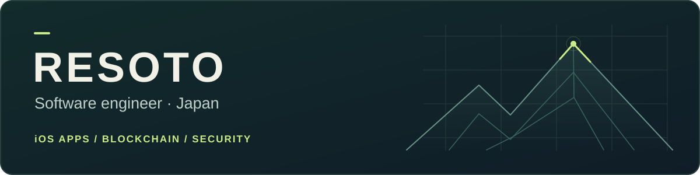
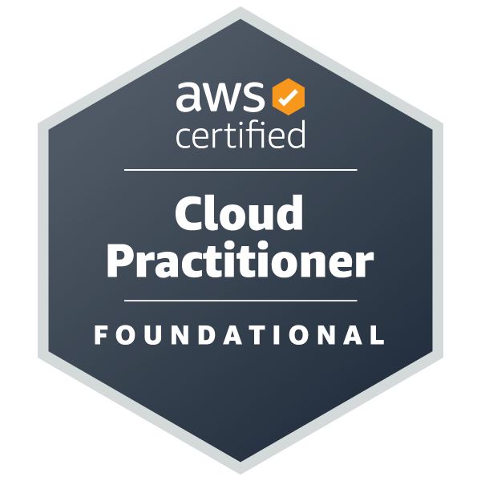

  

  
I build iOS apps for the outdoors and everyday life, and explore blockchain, decentralized infrastructure, and security. Swift enthusiast, mountain climber, and rubber duck lover.

  

    <a href="#selected-apps">Apps</a> ·
    <a href="#open-source">Open source</a> ·
    <a href="#skills--interests">Skills</a> ·
    <a href="#certifications">Certifications</a> ·
    <a href="mailto:bigmakiinum@outlook.jp">Contact</a>
  

## Selected apps

A few of the iOS apps I design and develop. **[Explore all apps at Resoto Apps →](https://app.resoto.net/)**

<table>
  <tr>
    <td width="50%" valign="top">
      
      <h3>WordTrail</h3>
      
<strong>English learning</strong>

      
Turn English articles into study material with on-device AI explanations, quizzes, and vocabulary review.

      
<a href="https://apps.apple.com/app/id6809215124">View on the App Store ↗</a>

    </td>
    <td width="50%" valign="top">
      
      <h3>Hiking Tools 山のツール</h3>
      
<strong>Hiking &amp; outdoors</strong>

      
An altimeter, compass, GPS recording, and bear bell in a customizable toolkit for the trail.

      
<a href="https://apps.apple.com/app/id6808866419">View on the App Store ↗</a>

    </td>
  </tr>
  <tr>
    <td width="50%" valign="top">
      
      <h3>IP Checker IPチェッカー</h3>
      
<strong>Network utilities</strong>

      
Check public IPv4/IPv6, VPN status, and ISP details, with connection history and shareable reports.

      
<a href="https://apps.apple.com/app/id6766568237">View on the App Store ↗</a>

    </td>
    <td width="50%" valign="top">
      
      <h3>ScanList</h3>
      
<strong>Scanning &amp; productivity</strong>

      
Scan QR codes and barcodes in batches, organize records, and export to Excel, CSV, or JSON.

      
<a href="https://apps.apple.com/app/id6799602111">View on the App Store ↗</a>

    </td>
  </tr>
</table>

## Open source

### BCASim · Blockchain Attack Simulator

An open-source blockchain simulator for attack analysis. Customize node behavior and protocol rules to explore double spending, selfish mining, and Sybil attacks.

**[Explore the repository →](https://github.com/bcasim/bcasim)**

  
See the network simulation

   
  

## Skills &amp; interests

  
  
  
  
  
  
  

## Certifications

  
  
  
  

## Contributions

<picture>
  <source media="(prefers-color-scheme: dark)" srcset="https://raw.githubusercontent.com/resoto/resoto/output/github-contribution-grid-snake-dark.svg" />
  <source media="(prefers-color-scheme: light)" srcset="https://raw.githubusercontent.com/resoto/resoto/output/github-contribution-grid-snake.svg" />
  
</picture>

---

  <a href="https://app.resoto.net/">Resoto Apps</a> ·
  <a href="mailto:bigmakiinum@outlook.jp">Email me</a>  
  

